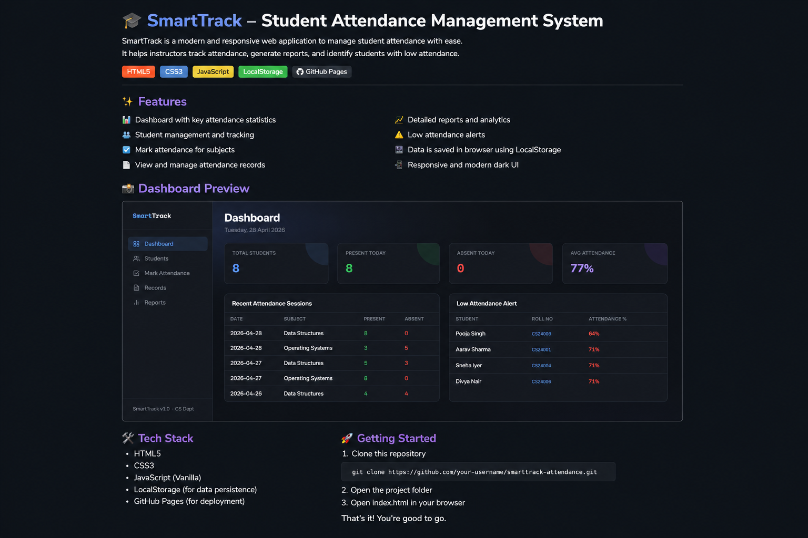

<div align="center">


<br/><br/>

[](https://developer.mozilla.org/en-US/docs/Web/HTML)
[](https://developer.mozilla.org/en-US/docs/Web/CSS)
[](https://developer.mozilla.org/en-US/docs/Web/JavaScript)
[](https://geethika1531.github.io/attendance-system/)
[](https://geethika1531.github.io/attendance-system/)
[](./LICENSE)

<br/>

**AttendEase** is a fully browser-based attendance management system for students — no backend, no setup, no friction. Built with vanilla HTML, CSS, and JavaScript, it delivers real-time tracking, rich analytics, and clean reporting right from `index.html`.

<br/>

[🌐 Live Demo](https://geethika1531.github.io/attendance-system/) · [📁 Source Code](https://github.com/geethika1531/attendance-system) · [🐛 Report Bug](https://github.com/geethika1531/attendance-system/issues) · [💡 Request Feature](https://github.com/geethika1531/attendance-system/issues)

</div>

---

## 📸 Screenshot(Preview)



---

## ✨ Features at a Glance

| Category | Feature | Details |
|---|---|---|
| 👩‍🎓 **Students** | Add / Edit / Delete | Full CRUD for student records |
| | Search & Filter | Instant search across all students |
| | Attendance % | Per-student attendance tracking |
| 📅 **Attendance** | Mark Status | Present / Absent / Late |
| | Bulk Actions | Mark all present or absent in one click |
| | Subject-wise | Track by individual subject |
| 📊 **Dashboard** | Overview Cards | Total students, daily summary, avg. attendance |
| | Low Alerts | Visual warnings for students below threshold |
| 📑 **Reports** | Filters | Search by date range and student |
| | Logs | Full attendance history |
| | Progress | Visual indicators per student |

---

## 🏗️ Project Structure

```
attendance-system/
├── index.html          # Main application (single-file SPA)
└── README.md           # Project documentation
```

> **Note:** This is a single-page application — all logic, styles, and data management live in `index.html`, powered by the browser's LocalStorage API.

---

## 🛠️ Tech Stack

| Layer | Technology | Purpose |
|---|---|---|
| Structure | HTML5 | Semantic layout and UI |
| Styling | CSS3 | Responsive design and theming |
| Logic | Vanilla JavaScript (ES6+) | DOM manipulation, state management |
| Storage | Browser LocalStorage API | Persistent data without a backend |
| Hosting | GitHub Pages | Free, zero-config deployment |

---

## 🚀 Getting Started

### Prerequisites

All you need is a modern web browser (Chrome, Firefox, Edge, Safari). No installs. No dependencies.

### Option 1 — Use the Live Demo

👉 Visit **[geethika1531.github.io/attendance-system](https://geethika1531.github.io/attendance-system/)** and start using it instantly.

### Option 2 — Run Locally

```bash
# 1. Clone the repository
git clone https://github.com/geethika1531/attendance-system.git

# 2. Navigate into the directory
cd attendance-system

# 3. Open in browser (any of these work)
open index.html            # macOS
start index.html           # Windows
xdg-open index.html        # Linux
```

No `npm install`. No build step. Just open and go.

---

## ⚠️ Known Limitations

| Limitation | Impact | Planned Fix |
|---|---|---|
| No backend | Data is local to your browser only | Backend API (Node.js/Flask) |
| No authentication | Anyone with the URL can access | Login/Signup system |
| LocalStorage only | Clearing browser data loses all records | Database integration |
| No export | Can't download attendance as CSV/PDF | Export feature planned |

---

## 🔮 Roadmap

### Phase 1 — Core (✅ Complete)
- [x] Dashboard with attendance overview
- [x] Student management (CRUD)
- [x] Attendance marking (Present / Absent / Late)
- [x] Reports and analytics
- [x] LocalStorage persistence

### Phase 2 — In Progress / Near-term
- [ ] 📤 Export reports to CSV and PDF
- [ ] 📱 Full mobile responsiveness
- [ ] 📊 Advanced charts (Chart.js or D3.js integration)

### Phase 3 — Future
- [ ] 🔐 User authentication (Login / Signup)
- [ ] ☁️ Backend API (Node.js or Flask)
- [ ] 🗄️ Database support (MongoDB or MySQL)
- [ ] 🤖 AI-powered attendance (Face Recognition / QR Code)

---

## 💡 Use Cases

- **Professors & Teachers** tracking daily class attendance
- **Students** self-monitoring their own attendance percentages
- **Institutions** looking for a lightweight, no-cost solution
- **Developers** learning single-file SPA architecture with LocalStorage

---

## 🤝 Contributing

Contributions are welcome! Here's how:

```bash
# 1. Fork the repository on GitHub
# 2. Create a feature branch
git checkout -b feature/your-feature-name

# 3. Commit your changes
git commit -m "feat: add [your feature]"

# 4. Push and open a Pull Request
git push origin feature/your-feature-name
```

Please follow conventional commit messages (`feat:`, `fix:`, `docs:`, `chore:`).

---

## 📄 License

This project is licensed under the [MIT License](./LICENSE) — free to use, modify, and distribute with attribution.

---

## 👩‍💻 Author

<div align="center">

**Sai Charishma**  
Third-year CS Undergraduate | Pragati Engineering College, Rajahmundry  

[](https://github.com/charishmasai99)

</div>

---

<div align="center">

⭐ **If you found this useful, please give it a star on GitHub!** ⭐  
It helps others discover the project and motivates continued development.

</div>